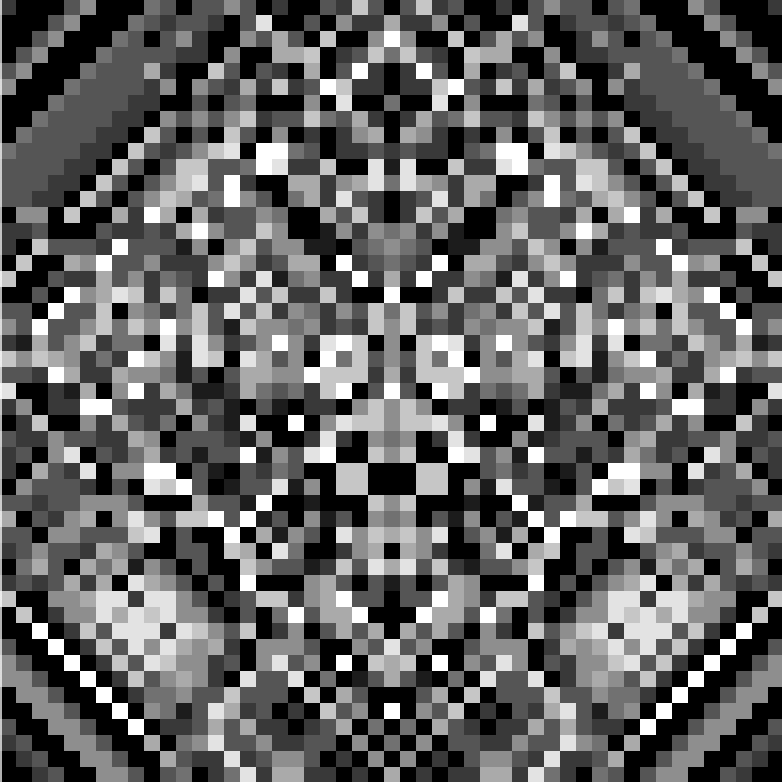

# Checkbox Automata

A simple sandbox app where you can click some cells of the pixel grid and watch interesting patterns, symmetrical and not. Patterns like this one:

If you'll get interested why is the CLAUDE.md here, I should say that the core idea and first implementation is my own, but the Claude helped me to do the mechanical stuff :)
